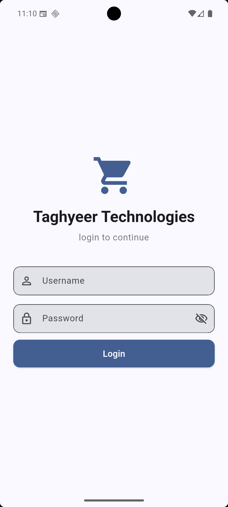
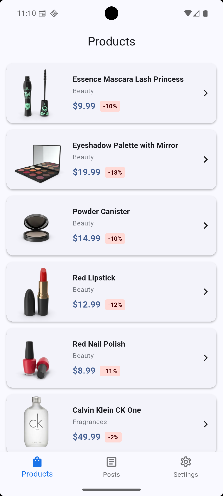
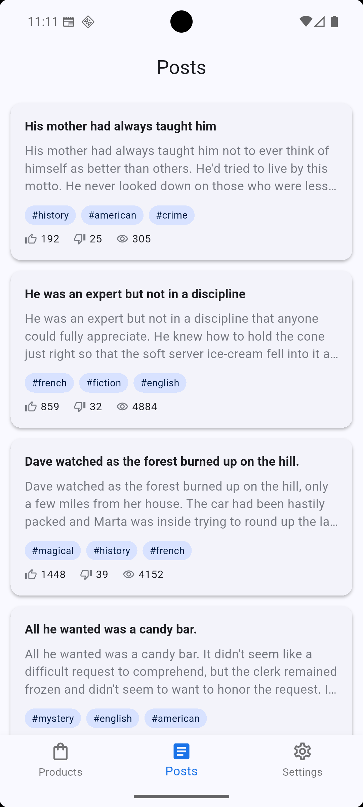
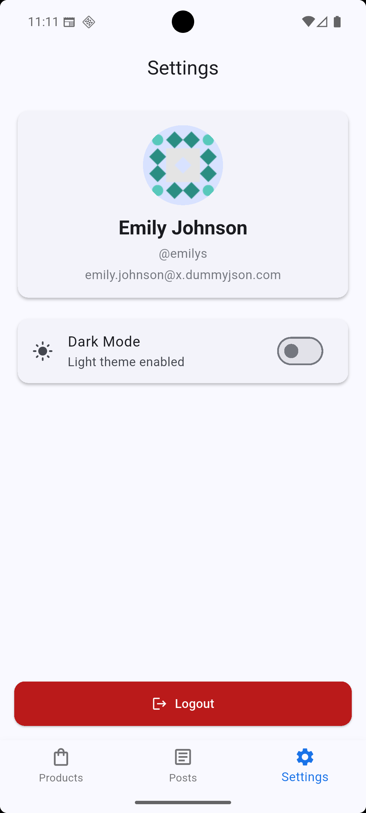
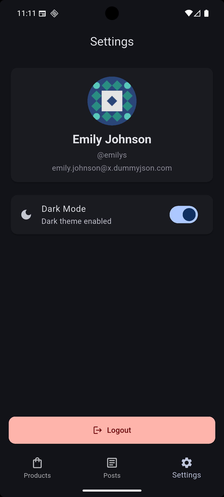
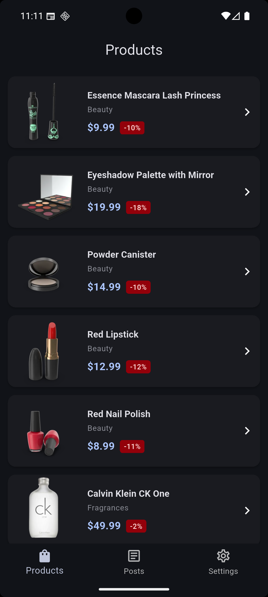
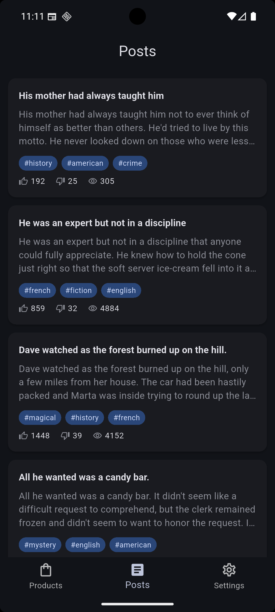

# Taghyeer Technologies - Flutter Assessment App


## Features

- **User Authentication** — Login with username & password via DummyJSON auth API
- **Cached User Session** — Auto-login on app restart; session persisted locally
- **Bottom Navigation** — 3 tabs: Products, Posts, Settings
- **Products Tab** — Paginated product list with thumbnail, title, price & discount badge
- **Product Detail** — Image carousel, rating, stock, brand, category, description
- **Posts Tab** — Paginated post list with title, body preview, tags, reactions & views
- **Post Detail** — Full content with like/dislike/view stats
- **Settings Tab** — User profile info, dark/light theme toggle, logout
- **Theme Switching** — Light/Dark mode toggle, persisted across app restarts
- **Pagination** — Infinite scroll with `skip`-based pagination on Products & Posts
- **Error Handling** — Graceful handling of no internet, timeout, API failure, empty data, pagination failure with retry options

---

## Tech Stack

| Category | Technology |
|---|---|
| Framework | Flutter |
| Language | Dart |
| State Management | GetX |
| HTTP Client | Dio |
| Local Storage | SharedPreferences |
| Image Caching | CachedNetworkImage |

---

## Architecture

```
lib/
├── core/
│   ├── constants/          # API URLs, pagination config
│   ├── network/            # Dio API client, custom exceptions
│   ├── theme/              # Light & dark Material 3 themes
│   └── utils/              # SharedPreferences storage service
├── data/
│   ├── models/             # User, Product, Post data models
│   └── repositories/       # Auth, Product, Post repositories
├── controllers/            # GetX controllers (Auth, Product, Post, Theme, Navigation)
├── screens/
│   ├── login/              # Login screen
│   ├── home/               # Home screen with bottom navigation
│   ├── products/           # Products list & detail screens
│   ├── posts/              # Posts list & detail screens
│   └── settings/           # Settings screen
├── widgets/                # Reusable widgets (error, loading, empty, pagination)
├── routes/                 # App routes & pages configuration
└── main.dart               # Entry point
```

---


### Installation

```bash
# Clone the repository
git clone https://github.com/<your-username>/taghyeer_technologies.git
cd taghyeer_technologies


### Demo Credentials

| Field | Value |
|---|---|
| Username | `emilys` |
| Password | `emilyspass` |

---


## Screenshots

| | | |
|---|---|---|
|  |  |  |
|  |  |  |
|  |  |  |
|  | | |

---


